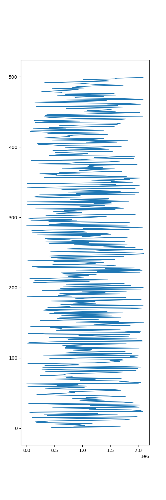
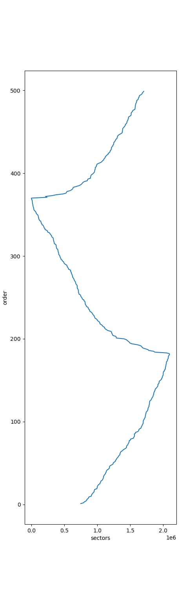

# TP2 - Escalonador de disco
## Lab SisOp \ Davi K Silva

---

Foram utilizados os códigos de aula para implementar a lógica de shortest seek time first (SSTF). A estratégia seguida foi percorrer a lista de requisições e executar o dispatch naquela com a menor distancia do ultimo. A logica implementada na função foi a seguinte:

    static int sstf_dispatch(struct request_queue *q, int force){
        struct sstf_data *nd = q->elevator->elevator_data;
        char direction = 'R';
        struct request *rq;
        struct request *listRq;
        struct request *shortRq;
        struct list_head *p;
        
        shortRq = list_first_entry_or_null(&nd->queue, struct request, queuelist);

        list_for_each(p, &nd->queue) {
                    listRq = list_entry(p, struct request, queuelist);

                    if(abs(blk_rq_pos(listRq)-lastSector) <  abs(blk_rq_pos(shortRq)-lastSector)){
                        //printk(KERN_EMERG "Shorter -> %llu < %llu \n", blk_rq_pos(listRq), lastSector);
                        shortRq = listRq;
                    }
                    // if(blk_rq_pos(rq) < blk_rq_pos(listRq)){
                    // 	list_add_tail(&rq->queuelist,p);
                    // }

        }

        rq = shortRq;
        if (rq) {
            lastSector = blk_rq_pos(rq);
            list_del_init(&rq->queuelist);
            elv_dispatch_sort(q, rq);
            printk(KERN_EMERG "[SSTF] dsp %c %llu\n", direction, blk_rq_pos(rq));

            return 1;
        }
        return 0;

Os resultados da execução podem ser encontrados em `out.txt`

A partir da execução, podemos plotar pela ordem de atendimento as requisições para vermos o desempenho.

FIFO:

SSTF implementado:

Com isso, fica visível a melhoria de performance que seria ganha em relação ao FIFO, já que a distancia total percorrido seria bem menor. 